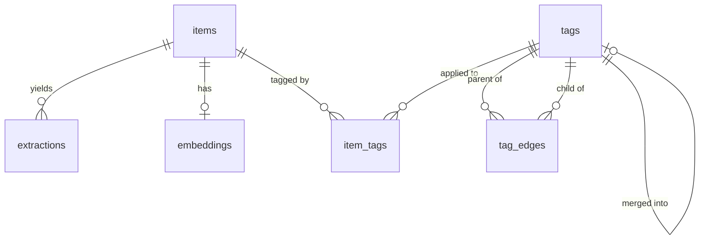

# Schema

Postgres + pgvector is the single source of truth. There is no separate vector
store, and admin read models depend on these tables, so column names are part of
the contract with the dashboard.

## ERD



`taxonomy_proposals` deliberately has no foreign keys — it references tags by
id inside a JSONB payload so a proposal survives the tags it mentions being
merged or retired while it sits in the queue.

## Tables

### `items`

One ingested artefact. The row is metadata only: media bytes live in blob
storage behind `raw_ref`, never in Postgres.

| Column | Rationale |
| --- | --- |
| `source`, `source_id` | Identity at the origin. `UNIQUE (source, source_id)` is the deduplication mechanism — connectors may over-fetch freely, and re-ingesting is a no-op. `source_id` is 512 chars because email `Message-ID` headers get long. |
| `kind` | Drives extractor selection (`audio` → faster-whisper, `image` → PaddleOCR-VL, `article` → parser). |
| `raw_ref` | Pointer to blob storage (`blob://<key>`), set by the pipeline once bytes are actually stored — never before, or a failed download would be indistinguishable from a successful one. Keeps personal media out of database backups and out of anything a `SELECT *` might print. A *source* media id (WhatsApp's, say) is not a blob ref and lives in `meta` instead. |
| `meta` | JSONB for source-specific fields (chat name, retweet counts, IMAP folder) that do not deserve columns. |

`ingested_at` is indexed because the dashboard's default view is reverse
chronological.

### `extractions`

Text recovered from an item. `UNIQUE (item_id, extractor)` means re-running an
extractor after a model upgrade replaces its output rather than accumulating
near-duplicates. Several extractors may run over one item, so this is not
unique on `item_id` alone.

### `embeddings`

One BGE-M3 vector per item — `item_id` is unique. `dim` is stored explicitly so
a future model change is detectable in data rather than inferred from the
column type. The HNSW index uses `vector_cosine_ops`; the recommender and
`ItemRepository.nearest` both query by cosine distance, so any other operator
class would silently stop using the index.

### `tags`

A node in the dynamic tag graph. There is no fixed taxonomy: the classifier
coins tags as it encounters new concepts.

| Column | Rationale |
| --- | --- |
| `slug` | Stable identity, derived deterministically from `label` (see `classification/slug.py`). Uniqueness on the slug is what makes "coin a tag" idempotent under concurrency. |
| `origin` | `llm` vs `human` — tells you whether a tag was invented or curated when reviewing the graph. |
| `status`, `merged_into_id` | Merged tags are retained and redirected rather than deleted, so historical `item_tags` rows stay interpretable. |

### `tag_edges`

Directed edges, `parent` broader than `child`. The graph is *not* guaranteed
acyclic — the classifier can propose an edge that closes a loop — which is
precisely why every traversal is depth-bounded (see below).

### `item_tags`

Assignment with `confidence` in `[0, 1]` (enforced by check constraint) and
`assigned_by`, so a human correction is distinguishable from a model guess.

### `taxonomy_proposals`

The review queue. Two check constraints do the real work:

- `ck_proposals_reviewer_recorded` — any non-`pending` row must name its
  reviewer, so a decision can never be anonymous.
- `ck_proposals_applied_status` — `applied_at` can only be set on an `applied`
  row, and `TaxonomyProposalRepository.mark_applied` refuses anything that was
  not first `approved`.

Together these mean an auto-executed merge cannot be represented in the
database, not merely that the code avoids one.

## Depth-bounded traversal

Recursive CTEs over `tags` carry an explicit `depth < :max_depth` predicate in
the recursive term. `build_ancestors_stmt` / `build_descendants_stmt` in
`storage/repositories.py` are the only places these are constructed, and both
reject a bound outside `[1, TAG_DEPTH_HARD_CEILING]`. A cycle therefore
terminates at the bound instead of spinning.

## Migrations

Alembic, one revision per change, never editing an applied revision. `env.py`
takes the URL from `catchment/config.py` — `alembic.ini` ships with an empty
`sqlalchemy.url` so no credential can be committed.

```bash
alembic upgrade head
alembic revision -m "add x"     # hand-write; autogenerate needs a live DB
alembic upgrade head --sql      # render offline to review before applying
```
